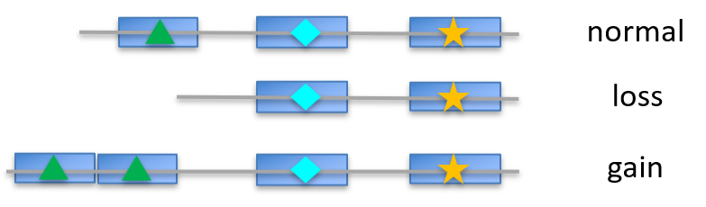
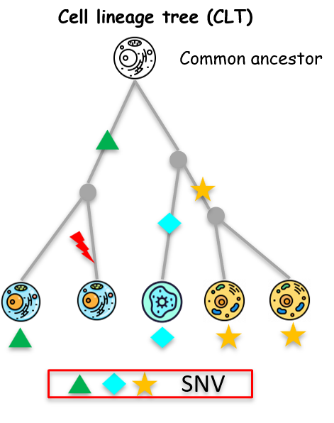

# What is ScisTreeCNA?

ScisTreeCNA reconstructs cell lineage trees from single-cell DNA sequencing data by modelling single-nucleotide variants (SNVs) and copy-number aberrations (CNAs) jointly, in one probabilistic framework.

:::{note}
ScisTreeCNA requires an **NVIDIA CUDA GPU** and there is no CPU fallback. If you only have SNV data and no copy numbers, use [ScisTree2](https://scistree2.readthedocs.io/en/latest/) instead — it is CPU-based and solves the SNV-only version of this problem.
:::

## Background

### Cell lineage trees

All cells in a multicellular organism descend from a single ancestral cell. A cell lineage tree (CLT) captures this history: its leaves represent sequenced cells, and its internal nodes represent their shared ancestors. For example, in a tumour, a CLT can reveal which cell populations are present, when they emerged, and which mutations define each expansion. For more details about CLTs and their applications, see the [ScisTree2 documentation](https://scistree2.readthedocs.io/en/latest/#cell-lineage-tree).

### Existing methods and their limitations

Most cell-lineage methods reconstruct trees from single-nucleotide variants (SNVs). These include distance-based methods, such as NJ and UPGMA, and likelihood- or model-based methods, such as ScisTree2, CellPhy, SiFit, and HUNTRESS. They typically represent each site as a binary genotype: 0 for wild type and 1 for mutant. This representation cannot capture changes in copy number or allele composition.

This limitation is particularly important in tumours, where copy-number alterations (CNAs) are common. CNAs can change the observed signal of an existing SNV without introducing a new point mutation (Figure below):

*Figure 1. Copy-number alterations can delete or duplicate genes (blue boxes) and their associated mutations (colored symbols), thereby changing the observed mutation profile.*

- **Copy-neutral loss of heterozygosity (CN-LOH)** removes the wild-type copy and duplicates the mutant copy. Although the total copy number remains 2, the expected variant allele fraction increases from about 0.5 to 1, potentially making an existing SNV appear newly acquired.
- **Copy-number gain** changes the expected allele fraction, so the same read counts may indicate different genotypes at different copy numbers.
- **Copy-number deletion** can remove the mutant copy, making an SNV disappear and resemble a back mutation, which violates the infinite-sites assumption.

*Figure 2. Copy-number loss can distort SNV-based distances. The red lightning bolt represents a copy-number loss that removes the green mutation, causing the descendant cell to lose an otherwise inherited mutation and potentially misleading distance-based tree reconstruction.*

As illustrated above, CNAs can alter the observed SNV profiles of descendant cells, distorting SNV-based distances and likelihood calculations that ignore copy number. Accurate reconstruction of cell evolution therefore requires the joint modeling of SNVs and CNAs.

## The model

Instead of binary or ternary genotypes, ScisTreeCNA uses a **generalized genotype** $(g_0, g_1)$, where $g_0$ and $g_1$ are the numbers of wild-type and mutant copies, respectively. This representation captures both copy number and mutation status. ScisTreeCNA defines a likelihood model over these genotypes and jointly uses reference and alternative read counts together with inferred copy numbers to reconstruct the cell lineage tree.

Following ScisTree2, ScisTreeCNA starts from an initial tree and uses local search to improve its topology until the likelihood no longer increases. For mathematical and algorithmic details, see the [ScisTreeCNA paper](https://www.biorxiv.org/content/10.1101/2025.11.21.689819v1).

### GPU acceleration

Scoring even a single tree is computationally expensive because each site may have many possible generalized genotypes. Exploring the space of tree topologies is also NP-hard and requires scoring many candidate trees. By exploiting the conditional-independence structure of the model, ScisTreeCNA expresses these likelihood calculations as batched matrix operations. Custom CUDA kernels then evaluate many candidate trees in parallel, making GPU acceleration essential for efficient inference.

## Where to go next

-  — install ScisTreeCNA and CuPy
-  — GPU requirements, and how to check your setup works
-  — run your first inference end to end
-  — the input formats in detail
-  — the `scistreecna` command-line tool
