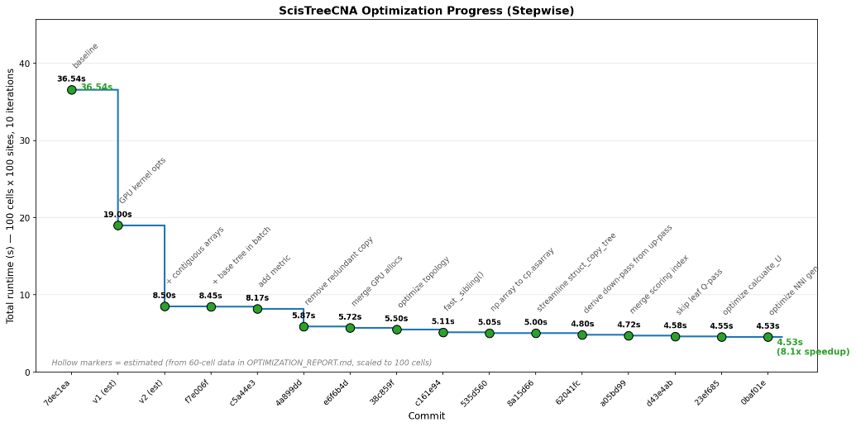

# Release notes

## Version 1.2.0

Added support for **allele-specific copy-number input**. ScisTreeCNA now accepts entries in either of the following formats:

- Total copy number: `ref|alt|cn`
- Allele-specific copy number: `ref|alt|cn_maj|cn_min`

The allele-specific format can be generated by tools such as CHISEL and does not require phased input. The generalized-genotype state space and transition model remain unchanged. Only the leaf-emission model differs: it marginalizes over the possible distributions of wild-type copies between the two homologs.

The CUDA kernels were also optimized using Claude Code with the AutoResearch framework.

*CUDA kernel optimization with Claude Code and AutoResearch.*

## Version 1.1.0

Introduced fused CUDA kernels and a contiguous memory layout for batched likelihood evaluation, substantially improving end-to-end performance without changing the inferred trees or genotypes.

Key improvements include:

- Combined the separate `U`, `U·Φ`, and `U·Φ′` allocations into one contiguous GPU buffer.
- Fused several log-space CUDA kernels.
- Improved topology precomputation and removed a quadratic-time topological sort.
- Derived the downward-pass order by reversing the upward-pass order.
- Skipped unused leaf nodes during the downward pass.
- Accelerated NNI candidate generation through prefiltering.
- Fixed a CUDA grid z-dimension overflow affecting large tree batches.
- Added `estimate_batch_sizes` to select `tree_batch_size` based on available GPU memory.

## Version 0.1.0

Initial release of ScisTreeCNA, including:

- Joint SNV–CNA cell lineage tree reconstruction under the JSC model.
- GPU-accelerated, batched NNI local search.
- Genotype calling.
- Copy-number event mapping.
- The `scistreecna` command-line interface.